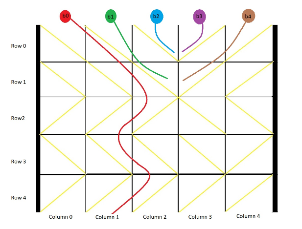

You have a 2-D `grid` of size `m x n` representing a box, and you have `n` balls. The box is open on the top and bottom sides.


Each cell in the box has a diagonal board spanning two corners of the cell that can redirect a ball to the right or to the left.

* A board that redirects the ball to the right spans the top-left corner to the bottom-right corner and is represented in the grid as `1`
* A board that redirects the ball to the left spans the top-right corner to the bottom-left corner and is represented in the grid as `-1`.


We drop one ball at the top of each column of the box. Each ball can get stuck in the box or fall out of the bottom. A ball gets stuck if it hits a "V" shaped pattern between two boards or if a board redirects the ball into either wall of the box.


Return an array `answer` of size `n` where `answer[i]` is the column that the ball falls out of at the bottom after dropping the ball from the `i` th column at the top, or `-1` if the ball gets stuck in the box


#### Example 1



```
Input: grid = [
	[ 1, 1, 1,-1,-1],
	[ 1, 1, 1,-1,-1],
	[-1,-1,-1, 1, 1],
	[ 1, 1, 1, 1,-1],
	[-1,-1,-1,-1,-1]
]
Output: [ 1,-1,-1,-1,-1]
```


#### Example 2

```
Input: grid = [[-1]]
Output: [-1]
The ball gets stuck against the left wall
```


#### 1. Questions

* $1 \leq m, n \leq 100$


#### 2. An Example


#### 3. An Initial Solution

* Determine the possible falling states: wrap as a function
  * For 1
    * If the right is also 1
      * Falls to the right, return 1
    * If the right is -1 or a wall (if the x coordinate is maxX)
      * Stuck, return 0
  * For -1
    * If the left is also -1
      * Falls through, return -1
    * If the left is 1 or a wall (if the x coordinate is 0)
      * Stuck return 0
* For each ball
  * While y <= maxY
    * If y = maxY
      * If fall through = 1
        * return x+1
      * Else if fall through = -1
        * return x-1
      * Else (fall through = 0)
        * return -1
    * Else (y < maxY)
      * If fall through = 1
        * x++, y++
      * Else if fall through = -1
        * x--, y++
      * Else (fall through = 0)
        * return -1


#### 4. Test The Solution

```java
public int[] findBall(int[][] grid) {
    int[] result = new int[grid[0].length];
    
    for (int col = 0; col < grid[0].length; col++) {
        int myCol = col;
        
        for (int row = 0; row < grid.length; row++) {
            if (row == grid.length - 1) {
                int dir = fall(row, myCol, grid);
                
                if (dir == 0) {
                    result[col] = -1;
                    break;
                }
                
                myCol += dir;
                result[col] = myCol;
                break;
            } else {
                int dir = fall(row, myCol, grid);
                
                if (dir == 0) {
                    result[col] = -1;
                    break;
                }
                
                myCol += dir;
            }
        }
    }
    
    return result;
}

public int fall(int currRow, int currCol, int[][] grid) {
    if (grid[currRow][currCol] == 1) {
        if ((currCol == grid[0].length - 1) || grid[currRow][currCol + 1] == -1) {
            return 0;
        } else {
            return 1;
        }
    } else {
        if ((currCol == 0) || grid[currRow][currCol - 1] == 1) {
            return 0;
        } else {
            return -1;
        }
    }
}
```

* I accidentally declared `result[]` inside the for loop, where it should have been declared at method scope


#### 5. Iterate Through Your Solution

* I could actually let `fall` handle the falling all by itself
  * Do recursive calls until it reach the end
  
  * Return the actual falling position in the end
    * Instead of a left/right/stuck flag


```java
public int[] findBall(int[][] grid) {
    int[] result = new int[grid[0].length];
    
    for (int col = 0; col < grid[0].length; col++) {
        result[col] = fall(0, col, grid);
    }
    
    return result;
}

public int fall(int currRow, int currCol, int[][] grid) {
    if (currRow == grid.length - 1) {
        if (grid[currRow][currCol] == 1) {
            if ((currCol == grid[0].length - 1) || grid[currRow][currCol + 1] == -1) {
                return -1;
            } else {
                return currCol + 1;
            }
        } else {
            if ((currCol == 0) || grid[currRow][currCol - 1] == 1) {
                return -1;
            } else {
                return currCol - 1;
            }
        }
    } else {
        if (grid[currRow][currCol] == 1) {
            if ((currCol == grid[0].length - 1) || grid[currRow][currCol + 1] == -1) {
                return -1;
            } else {
                return fall(currRow + 1, currCol + 1, grid);
            }
        } else {
            if ((currCol == 0) || grid[currRow][currCol - 1] == 1) {
                return -1;
            } else {
                return fall(currRow + 1, currCol - 1, grid);
            }
        }
    }
}
```


#### 6. Implement The Code


#### 7. Walk Through and Test Implementation

