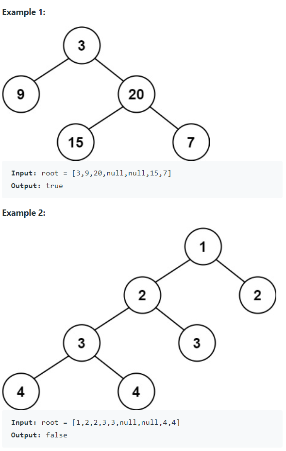

Given a binary tree, determine if it is height-balanced.

For this problem, a height-balanced binary tree is defined as:

A binary tree in which the left and right subtrees of every node differ in height by no more than 1.


Definition for a binary tree node:

```java
public class TreeNode {
    int val;
    TreeNode left;
    TreeNode right;
    TreeNode() {}
    TreeNode(int val) { this.val = val; }
    TreeNode(int val, TreeNode left, TreeNode right) {
        this.val = val;
        this.left = left;
        this.right = right;
    }
}
```


#### Examples



* Empty tree? Return true


#### 1. Questions

* How many nodes in total?
  * $0 \leq n \leq 5000$
* Values?
  * Integer, $-10^4 \leq val \leq 10^4$


#### 2. An Example


#### 3. An Initial Solution

* This problem has **two states to pass**
  * The height has to be passed to its parent
  * Whether it is balanced has to be passed to its parent

* Solution?
* **Use sentinel**
  * Exploit the fact that when the sentinel state is triggered, the height data is not required anymore

* If it is unbalanced, its parent is unbalanced, the height does not matter anymore
  * Return a sentinel `-1`
* If it is not unbalanced, continue to return its height

```java
class Solution {
    public boolean isBalanced(TreeNode root) {
        int res = helper(root);
        
        if (res == -1) return false;
        
        return true;
    }
    
    private int helper(TreeNode node) {
        if (node == null) return 0;
        
        int leftHeight = helper(node.left);
        if (leftHeight == -1) return -1;
        
        int rightHeight = helper(node.right);
        if (rightHeight == -1) return -1;
        
        if (Math.abs(leftHeight - rightHeight) > 1) return -1;
        
        return Math.max(leftHeight, rightHeight) + 1;
    }
}
```


#### 4. Test The Solution


#### 5. Iterate Through Your Solution

* Could this be **written without recursion**?


#### 6. Implement The Code


#### 7. Walk Through and Test Implementation

