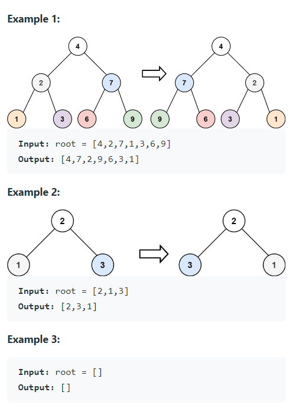

Given the `root` of a binary tree, invert the tree, and return its root.


Definition for a binary tree node:

```java
public class TreeNode {
    int val;
    TreeNode left;
    TreeNode right;
    TreeNode() {}
    TreeNode(int val) { this.val = val; }
    TreeNode(int val, TreeNode left, TreeNode right) {
        this.val = val;
        this.left = left;
        this.right = right;
    }
}
```


#### Examples




#### 1. Questions

* How many nodes in total?
  * $0 \leq n \leq 100$
* What are the values?
  * Integers, $-100 \leq val \leq 100$


#### 2. An Example


#### 3. An Initial Solution

* Go through a BFS
  * In each traversal, flip the children of the node

```java
class Solution {
    public TreeNode invertTree(TreeNode root) {
        LinkedList<TreeNode> queue = new LinkedList<>();
        
        if (root == null) {
            return null;
        }
        
        queue.add(root);
        
        while (! queue.isEmpty()) {
            TreeNode node = queue.poll();
            
            if (node.left == null && node.right == null) {
                continue;
            } else if (node.left == null) {
                queue.add(node.right);
                node.left = node.right;
                node.right = null;
            } else if (node.right == null) {
                queue.add(node.left);
                node.right = node.left;
                node.left = null;
            } else {
                queue.add(node.left);
	            queue.add(node.right);
                TreeNode temp = node.left;
                node.left = node.right;
                node.right = temp;
            }
        }
        
        return root;
    }
}
```


#### 4. Test The Solution


#### 5. Iterate Through Your Solution

* DFS is probably better, as it does not require a queue that is $O(n)$
  * It requires a stack that is $O(\log n)$


#### 6. Implement The Code


#### 7. Walk Through and Test Implementation

