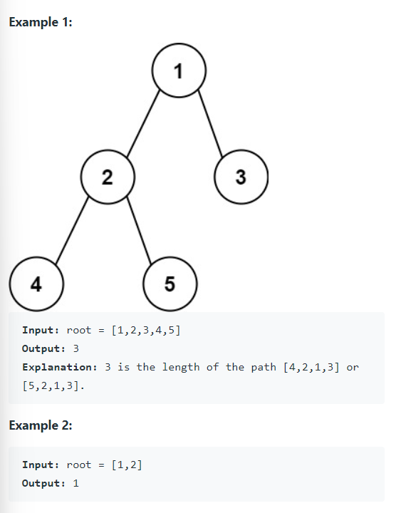

Given the `root` of a binary tree, return the length of the diameter of the tree.

The diameter of a binary tree is the length of the longest path between any two nodes in a tree. This path may or may not pass through the `root`.

The length of a path between two nodes is represented by the number of edges between them.


#### Examples




#### 1. Questions

* Note: $path = node - 1$
* Number of nodes in the tree $1 \leq n \leq 10^4$
* Values: integer $-11 \leq val \leq 100$


#### 2. An Example


#### 3. An Initial Solution

* There are two states to pass
  * The height of itself has to be passed to its parent
  * The parent has to somehow record the maximum path by constructing the height of its children
* Solution? Instance fields
  * Since the maximum possible path is global to all recursion instance
    * They can compare its current value with the maximum and change the maximum accordingly
    * They can then return its own height only to their parents

```java
class Solution {
    private int max;
    
    public int diameterOfBinaryTree(TreeNode root) {
        max = 0;
        recursion(root);
        
        return max;
    }
    
    private int recursion(TreeNode node) {
        if (node == null) return 0;
        
        int leftMax = recursion(node.left);
        int rightMax = recursion(node.right);
        
        int myDiameter = leftMax + rightMax;
        max = (myDiameter > max) ? myDiameter : max;
        
        return (leftMax > rightMax) ? leftMax + 1 : rightMax + 1;
    }
}
```


#### 4. Test The Solution


#### 5. Iterate Through Your Solution


#### 6. Implement The Code


#### 7. Walk Through and Test Implementation

