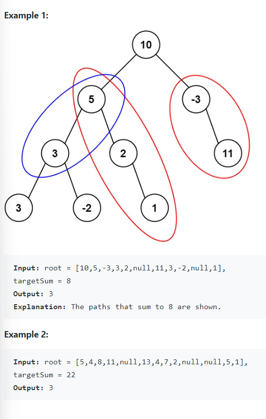

Given the `root` of a binary tree and an integer `targetSum`, return the number of paths where the sum of the values along the path equals `targetSum`.

The path does not need to start or end at the root or a leaf, but it must go downwards (i.e. travelling only from parent nodes to child nodes).


Definition for a binary tree node:

```java
public class TreeNode {
    int val;
    TreeNode left;
    TreeNode right;
    TreeNode() {}
    TreeNode(int val) { this.val = val; }
    TreeNode(int val, TreeNode left, TreeNode right) {
        this.val = val;
        this.left = left;
        this.right = right;
    }
}
```


#### Example 1




#### 1. Questions

* Number of nodes? $0 \leq n \leq 1000$
* Value? Integer, $-10^9 \leq val \leq 10^9$
* Target? $-1000 \leq target \leq 1000$


#### 2. An Example


#### 3. An Initial Solution

* Naive method?
  * Extract all possible paths: $O(\log n)$ to $O(n)$
    * If the tree happens to be a linked list
  * For each path, do a sum of combination: $O(n^2)$
  * $O(n^2 \log n)$ to $O(n^3)$
    * Not a good solution
* Can we do better?
  * The sum of combination is very repetitive
  * The sum of the parent could be reused by the children, and their children and so on
* For each node, given previous parent's sum list
  * Create its own sum list
    * Add itself as the first element
    * For each parent's sum, add itself and add to its own sum list
      * If `sum == target`, increment `counter`
  * Pass the sum list to its children
    * Add the children's return values to `counter`
  * Return `counter`
* Concerns?
  * Double counting? No: because the child's list includes the child itself, and subsequent values taken from the parent are added with child's value
  * Sum list reference problem? No: because the child will reconstruct a new sum list, instead of use its parent's sum list
* Time complexity:
  * Each node has to do it once: $O(n)$
  * Each list creation: $O(\log n)$
  * Total time complexity: $O(n \log n)$
  * Total space complexity: the call stack $O(\log n)$

```java
public class Solution {
    public int pathSum(TreeNode root, int targetSum) {
        if (root == null) return 0;
        
        LinkedList<Long> mySumList = new LinkedList<>();
        
        return subpathSum(root, targetSum, mySumList);
    }
    
    private int subpathSum(TreeNode node, long targetSum, LinkedList<Long> parentSumList) {
        LinkedList<Long> mySumList = new LinkedList<>();
        int counter = 0;
        
		mySumList.add((long)(node.val));
        
        if (node.val == targetSum) counter++;
        
        for (long sum : parentSumList) {
            long newSum = sum + node.val;
            
            if (newSum == targetSum) counter++;
            
            mySumList.add(newSum);
        }
        
        if (node.left != null) {
            counter += subpathSum(node.left, targetSum, mySumList);
        }
        
        if (node.right != null) {
            counter += subpathSum(node.right, targetSum, mySumList);
        }
        
        return counter;
    }
}
```


#### 4. Test The Solution

* Good enough?
  * This caused integer overflow
  * Use long instead
* This actually runs very slow and takes a lot of memory
  * What could be improved?


#### 5. Iterate Through Your Solution


#### 6. Implement The Code


#### 7. Walk Through and Test Implementation

