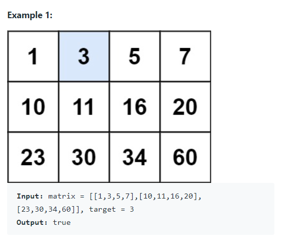
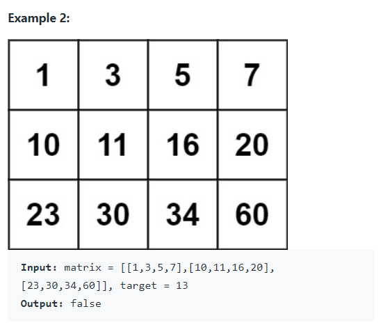

Write an efficient algorithm that searches for a value `target` in an `m x n` integer matrix `matrix`. This matrix has the following properties

* Integers in each row are sorted from left to right.
* The first integer of each row is greater than the last integer of the previous row.


#### Examples






#### 1. Questions

* Repeating numbers?
  * Not sure
  * Not likely
* $m = matrix.length$
* $n = matrix[0].length$
* $1 \leq m, n \leq 100$
* $-10^4 \leq matrix[i][j] \leq 10^4$


#### 2. An Example


#### 3. An Initial Solution

* Use binary search
* 2D? Map between 2D and 1D indices
* Binary search 1D

```java
public boolean searchMatrix(int[][] matrix, int target) {
	int lb = 0;
    int ub = matrix.length * matrix[0].length - 1;
    
    while (lb <= ub) {
        int mid = (lb + ub) / 2;
        
        int iMid = getCol(mid, matrix);
        int jMid = getRow(mid, matrix);
        
        if (matrix[iMid][jMid] == target) {
            return true;
        } else if (matrix[iMid][jMid] < target) {
            lb = mid + 1;
        } else {
            ub = mid - 1;
        }
    }
    
    return false;
}

private int getCol(int index, int[][] matrix) {
    return index / matrix[0].length;
}

private int getRow(int index, int[][] matrix) {
    return index % matrix[0].length;
}
```


#### 4. Test The Solution

* I messed up column vs row
  * **Don't confuse $i, j$, row, col or $x, y$**


#### 5. Iterate Through Your Solution

* This is the best you can do to a sorted list


#### 6. Implement The Code


#### 7. Walk Through and Test Implementation

