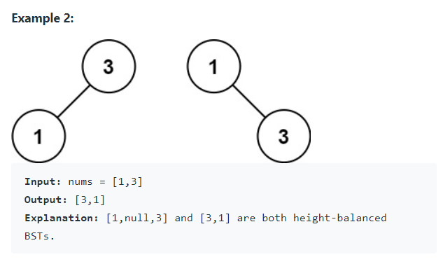

Given an integer array `nums`, where the elements are sorted in ascending order, convert it to a height-balanced binary search tree.

A height-balanced binary tree is a binary tree in which the depth of the two subtrees of every node never differs by more than one.


Definition for a binary tree node:

```java
public class TreeNode {
    int val;
    TreeNode left;
    TreeNode right;
    TreeNode() {}
    TreeNode(int val) { this.val = val; }
    TreeNode(int val, TreeNode left, TreeNode right) {
        this.val = val;
        this.left = left;
        this.right = right;
    }
}
```


#### Examples





#### 1. Questions

* $1 \leq nums.length \leq 10^4$
* $-10^4 \leq nums[i] \leq 10^4$
* Sorted in strictly increasing order
  * No duplicate values


#### 2. An Example


#### 3. An Initial Solution

* Find the centermost element `nums[mid]` and make it the root
* Split the array into two subarray, one before `nums[mid]`, another after `nums[mid]`
* Call this function on each of the subarrays

```java
public class Solution {
    public TreeNode sortedArrayToBST(int[] nums) {
        return appendChild(nums, 0, nums.length - 1);
    }
    
    private TreeNode appendChild(int[] nums, int start, int end) {
        // handle special cases
        if (start == end) {
            TreeNode par = new TreeNode(nums[start]);
            return par;
        }
        
        if (start == end - 1) {
            TreeNode par = new TreeNode(nums[start]);
            par.right = new TreeNode(nums[end]);
            return par;
        }
        
        int mid = (start + end) / 2;
        TreeNode par = new TreeNode(nums[mid]);
        
        // special cases here?
        par.left = appendChild(nums, start, mid - 1);
        par.right = appendChild(nums, mid + 1, end);
        
        return par;
    }
}
```

* When `start == end`, there are no more child nodes
* Since `mid - 1` could be less than `start`
  * Find out how this would occur
    * When `start == end - 1`
    * Handle this case beforehand


#### 4. Test The Solution


#### 5. Iterate Through Your Solution


#### 6. Implement The Code


#### 7. Walk Through and Test Implementation

