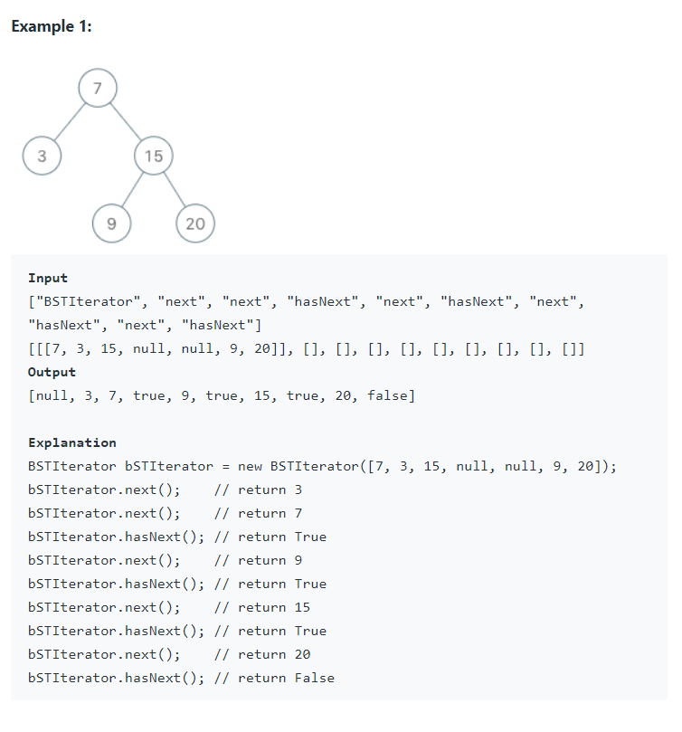

Implement the `BSTIterator` class that represents an iterator over the in-order traversal of a binary search tree (BST).

* `BSTIterator(TreeNode root)` Initializes an object of the `BSTIterator` class. The `root` of the BST is given as part of the constructor. The pointer should be initialized to a non-existent number smaller than any element in the BST.
* `boolean hasNext()` Returns `true` if there exists a number in the traversal to the right of the pointer, otherwise returns `false`.
* `int next()` Moves the pointer to the right, then returns the number at the pointer.

Notice that by initializing the pointer to a non-existent smallest number, the first call to `next()` will return the smallest element in the BST.

You may assume that `next()` calls will always be valid. That is, there will be at least a next number in the in-order traversal when `next()` is called.


Follow up: Could you implement `next()` and `hasNext()` to run in average `O(1)` time and use `O(h)` memory, where `h` is the height of the tree?


Definition for a binary tree node:

```java
public class TreeNode {
    int val;
    TreeNode left;
    TreeNode right;
    TreeNode() {}
    TreeNode(int val) { this.val = val; }
    TreeNode(int val, TreeNode left, TreeNode right) {
        this.val = val;
        this.left = left;
        this.right = right;
    }
}
```


#### Example




#### 1. Questions

* Number of nodes: $[1, 10^5]$
* $0 \leq val \leq 10^6$
* At most $10^5$ calls will be made to `hasNext` and `next`


#### 2. An Example


#### 3. An Initial Solution

```java
class BSTIterator {
    Stack<TreeNode> stack;

    public BSTIterator(TreeNode root) {
        stack = new Stack<TreeNode>();
        stack.push(root);
        
        TreeNode curr = root;
        while (curr.left != null) {
            stack.push(curr.left);
            curr = curr.left;
        }
    }
    
    public int next() {
        TreeNode curr = stack.pop();
        
        if (curr.right != null) {
            TreeNode child = curr.right;
            stack.push(child);
            
            while (child.left != null) {
                stack.push(child.left);
                child = child.left;
            }
        }
        
        return curr.val;
    }
    
    public boolean hasNext() {
        return !stack.isEmpty();
    }
}
```


#### 4. Test The Solution


#### 5. Iterate Through Your Solution

* Analysis
  * Space complexity: $O(h)$ at most, as the stack will at most only contain a full branch of the tree, which is at most $h$
  * Time complexity:
    * While doing the left part of in-order traversal, `curr.left != null`
      * $O(h)$
    * In `next()`
      * While `curr.right == null` 
        * $O(1)$
      * While `curr.right != null`
        * $O(1) + O(x) = O(x)$ as it has to do the left part of in-order traversal
        * How to analyze $x$?
          * Should be amortized to $O(1)$?
    * In `hasNext()`
      * Check if the stack is empty: $O(1)$
* This solution should suffice the follow-up question
* You could probably use `LinkedList` or `ArrayList` instead of `Queue`


#### 6. Implement The Code


#### 7. Walk Through and Test Implementation

