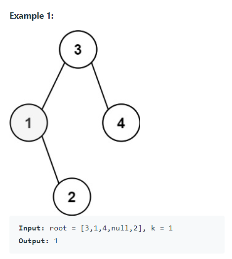
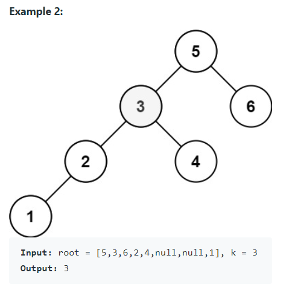

Given the `root` of a binary search tree, and an integer `k`, return the `k`-th smallest value (1-indexed) of all the values of the nodes in the tree.


Follow up: if the BST is modified often (i.e., we can do insert and delete operations) and you need to find the `k`-th smallest frequently, how would you optimize?


Definition for a binary tree node:

```java
public class TreeNode {
    int val;
    TreeNode left;
    TreeNode right;
    TreeNode() {}
    TreeNode(int val) { this.val = val; }
    TreeNode(int val, TreeNode left, TreeNode right) {
        this.val = val;
        this.left = left;
        this.right = right;
    }
}
```


#### Examples






#### 1. Questions

* Number of nodes `n`
* $1 \leq k \leq n \leq 10^4$
  * $k$ will never exceed $n$
* $0 \leq val \leq 10^4$


#### 2. An Example


#### 3. An Initial Solution

* While `counter != target` and stack is not empty
  * If `curr` `hasLeft`
    * Push `left` to stack
  * Else
    * Visit `curr`: pop stack, assign value, counter++
    * If `curr` `hasRight`
      * Push `right` to stack
* Return value

```java
public int kthSmallest(TreeNode root, int k) {
	int value = 0;
    int counter = 0;
    Stack<TreeNode> stack = new Stack<TreeNode>();
    HashSet<TreeNode> visited = new HashSet<TreeNode>();
    stack.push(root);
    
    while (counter != k && !stack.isEmpty()) {
        TreeNode curr = stack.peek();
        if (curr.left != null && !visited.contains(curr.left)) {
            stack.push(curr.left);
        } else {
            stack.pop();
            visited.add(curr);
            value = curr.val;
            counter++;
            
            if (curr.right != null) {
                stack.push(curr.right);
            }
        }
    }
    
    return value;
}
```


#### 4. Test The Solution


#### 5. Iterate Through Your Solution

* If BST is modified often, and you need to find the `k`-th smallest often, how would you optimize?
  * Make sure the BST is balanced
  * Maintain a doubly-linked list
    * Insert both the BST and DLL together
      * The BST references to the elements of DLL: constant time
    * Insertion/deletion: $O(\log n + k)$
    * Search the DLL: $O(k)$


#### 6. Implement The Code


#### 7. Walk Through and Test Implementation

