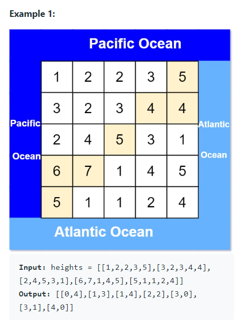

There is an `m x n` rectangular island that borders both the Pacific Ocean and Atlantic Ocean. The Pacific Ocean touches the island's left and top edges, and the Atlantic Ocean touches the island's right and bottom edges.

The island is partitioned into a grid of square cells. You are given an `m x n` matrix `heights` where `heights[r][c]` represents the height above sea level of the cell at coordinate `(r, c)`.

The island receives a lot of rain, and the rain water can flow to neighboring cells directly north south east and west if the neighboring cell's height is less than or equal to the current cell's height. Water can flow from any cell adjacent to an ocean into the ocean.

Return a 2D list of grid coordinates `result` where `result[i] = [r_i, c_i]` denotes that rain water can flow from cell `(r_i, c_i)` to both the Pacific and Atlantic oceans.


#### Examples



```
Input: heights = [[2, 1], [1, 2]]
Output: [[0, 0], [0, 1], [1, 0], [1, 1]]
```


#### 1. Questions


#### 2. An Example


#### 3. An Initial Solution

* Dynamic programming
* Start with two data caches
  * `int[][] canPO`
  * `int[][] canAO`
* Both caches have the same sizes as `heights`
  * If it can flow to PO/AO: `1`
  * Not initialized: `0`
  * If it cannot flow to PO/AO: `-1`
* (Checking for PO) For each element
  * Call `checkPO()`
* (Checking for AO) For each element
  * Call `checkAO()`
* Method `checkPO()` and also `checkAO` in a similar manner
  * Check if it `canPO == 1` or `canPO == -1`, return accordingly
  * If `canPO == 0`
    * Check if it is adjacent to PO
      * Yes: mark itself `canPO = 1`, then return yes
      * No:
        * For any neighbors with height `<=` itself
          * Call `checkPO()`
        * If any of them is `true`, mark itself `canPO = 1`, return true
        * If non of them is `true`, mark itself `canPO = -1`, return false
* For each element
  * If both `canPO` and `canAO`, append to array list
* Return array list

```java
class Solution {
    public List<List<Integer>> pacificAtlantic(int[][] heights) {
        int maxRow = heights.length;
        int maxCol = heights[0].length;
        
        int[][] canPO = new int[maxRow][maxCol];
        int[][] canAO = new int[maxRow][maxCol];
        
        // populate elements adjacent to PO/AO
        for (int row = 0; row < maxRow; row++) {
            canPO[row][0] = 1;
            canAO[row][maxCol-1] = 1;
        }
        
        for (int col = 0; col < maxCol; col++) {
            canPO[0][col] = 1;
            canAO[maxRow-1][col] = 1;
        }
        
        for (int row = 1; row < maxRow; row++) {
            for (int col = 1; col < maxCol; col++) {
                checkFlowable(row, col, canPO, heights);
            }
        }
        
        for (int row = 0; row < maxRow - 1; row++) {
            for (int col = 0; col < maxCol - 1; col++) {
                checkFlowable(row, col, canAO, heights);
            }
        }
        
        List<List<Integer>> result = new ArrayList<List<Integer>>();
        
        for (int row = 0; row < maxRow; row++) {
            for (int col = 0; col < maxCol; col++) {
                if (canPO[row][col] == 1 && canAO[row][col] == 1) {
                    List<Integer> coord = new ArrayList<Integer>();
                    coord.add(row);
                    coord.add(col);
                    result.add(coord);
                }
            }
        }
        
        return result;
    }
    
    private int checkFlowable(int row, int col, int[][] flowMap, int[][] heights) {
        // looping flag: used to prevent a self looping "dry" area
        // "-1 means don't ask me, I am still waiting for the answer"
        // but itself it not assigned -1, because it is pending the previous stack to return it to normal value
        if (flowMap[row][col] == 2) {
            return -1;
        }
        
        if (flowMap[row][col] == 1 || flowMap[row][col] == -1)
            return flowMap[row][col];
        
        // looping flag: this will eventually be marked as 1 or -1
        flowMap[row][col] = 2;
        
        if (row > 0 && heights[row - 1][col] <= heights[row][col]) {
            int queryTop = checkFlowable(row - 1, col, flowMap, heights);
            if (queryTop == 1) {
                flowMap[row][col] = 1;
                connNeighbor(row, col, flowMap, heights);
                return 1;
            }
        }
        
        if (row < flowMap.length - 1 && heights[row + 1][col] <= heights[row][col]) {
            int queryBtm = checkFlowable(row + 1, col, flowMap, heights);
            if (queryBtm == 1) {
                flowMap[row][col] = 1;
                connNeighbor(row, col, flowMap, heights);
                return 1;
            }
        }
        
        if (col > 0 && heights[row][col - 1] <= heights[row][col]) {
            int queryLeft = checkFlowable(row, col - 1, flowMap, heights);
            if (queryLeft == 1) {
                flowMap[row][col] = 1;
                connNeighbor(row, col, flowMap, heights);
                return 1;
            }
        }
        
        if (col < flowMap[0].length - 1 && heights[row][col + 1] <= heights[row][col]) {
            int queryRight = checkFlowable(row, col + 1, flowMap, heights);
            if (queryRight == 1) {
                flowMap[row][col] = 1;
                connNeighbor(row, col, flowMap, heights);
                return 1;
            }
        }
        
        flowMap[row][col] = -1;
        return -1;
    }
    
    private void connNeighbor(int row, int col, int[][] flowMap, int[][] heights) {
        // as the search might accidentally flag neighbor of the same height as -1
        // this method will patch that problem
        if (row > 0 && heights[row - 1][col] == heights[row][col]) {
            flowMap[row - 1][col] = 1;
        }
        
        if (row < flowMap.length - 1 && heights[row + 1][col] == heights[row][col]) {
            flowMap[row + 1][col] = 1;
        }
        
        if (col > 0 && heights[row][col - 1] == heights[row][col]) {
            flowMap[row][col - 1] = 1;
        }
        
        if (col < flowMap[0].length - 1 && heights[row][col + 1] == heights[row][col]) {
            flowMap[row][col + 1] = 1;
        }
        
    }
    
}
```


#### 4. Test The Solution

* There is no reference when the land touches the sea
  * Initialize all edges with sea tags
* There can be loops in the search
  * Use flag to break out of the loop
  * Do proper handling when treating the flag


#### 5. Iterate Through Your Solution

* This solution has too many edge cases
* **This solution is also calculating unnecessary blocks**
  * Some of them are flowable, but all of them have to be calculated
* **Invert the solution**
  * Start from the edges, and search their water sources along the way
    * All flowable sources will be found
    * While other non-flowable ones will not be traversed
  * No more additional flags needed
    * No loop-breaking flag
    * No checked flag
* **This problem has a notion of flowing downwards, thus conditioning us to think that way**
  * **But a better solution would not always come up that way**


#### 6. Implement The Code


#### 7. Walk Through and Test Implementation

