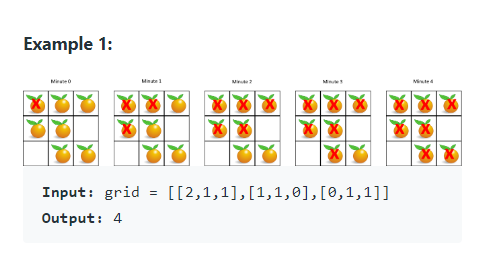

You are given an `m x n` `grid` where each cell can have one of three values:

* `0` representing an empty cell
* `1` representing a fresh orange, or
* `2` representing a rotten orange

Every minute, any fresh orange that is 4-directionally adjacent to a rotten orange becomes rotten.

Return the minimum number of minutes that must elapse until no cell has a fresh orange. If that is impossible, return `-1`.


#### Example 1




#### Example 2

```
Input: grid = [[2, 1, 1], [0, 1, 1], [1, 0, 1]]
Output: -1
Left bottom corner is never going to rot.
```


#### Example 3

```
Input: grid = [[0, 2]]
Output: 0
There are no fresh oranges to start with.
```


#### 1. Questions

* $m = grid.length$
* $n = grid[0].length$
* $1 \leq m, n \leq 10$
* $grid[i][j]$ is `0`, `1` or `2`


#### 2. An Example


#### 3. An Initial Solution

* Naive solution: simulate the process
  * Each day, update all the elements
  * Until no updates are possible, return
  * Time complexity $O((m + n) * m * n)$
    * Not so bad? for $m, n \leq 10$

```java
public class Solution {
    public int orangesRotting(int[][] grid) {
        int mMax = grid.length;
        int nMax = grid[0].length;
        
        int day = 0;
        int freshCount = 0;
        boolean change = true;
        
        for (int m = 0; m < mMax; m++) {
            for (int n = 0; n < nMax; n++) {
				if (grid[m][n] == 1) freshCount++;
            }
        }
        
        while (freshCount > 0 && change == true) {
            change = false;
            
            for (int m = 0; m < mMax; m++) {
				for (int n = 0; n < nMax; n++) {
                    if (grid[m][n] == 1) {
                        if (
                            (m > 0 && grid[m-1][n] == 2) ||
                            (n > 0 && grid[m][n-1] == 2) ||
                            (m < mMax - 1 && grid[m+1][n] == 2) ||
                            (n < nMax - 1 && grid[m][n+1] == 2)
                           ) {
                            change = true;
                            freshCount--;
                            grid[m][n] = 3;
                        }
                    }
                }
            }
            
            if (change) {
                day++;
                
                for (int m = 0; m < mMax; m++) {
                    for (int n = 0; n < nMax; n++) {
                        if (grid[m][n] == 3) grid[m][n] = 2;
                    }
                }
            }
        }
        
        if (freshCount > 0) {
            return -1;
        } else {
	        return day;
        }
    }
}
```


#### 4. Test The Solution


#### 5. Iterate Through Your Solution


#### 6. Implement The Code


#### 7. Walk Through and Test Implementation

